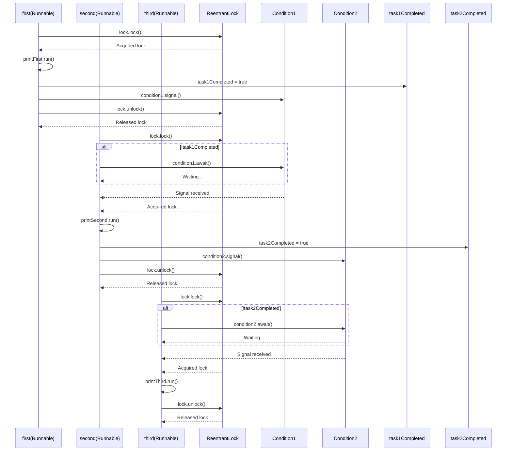

# Personal Try
## Java Concept: `CountDownLatch`
`CountDownLatch` allows you to block threads until the specified number of events (or tasks) have completed. You can configure each `Runnable` to wait for the previous one to complete by counting down the latch.

## Implementation
Sample usage.
```java
import java.util.concurrent.CountDownLatch;

public class SequenceRunnables {
    public static void main(String[] args) {
        CountDownLatch latch1 = new CountDownLatch(1);
        CountDownLatch latch2 = new CountDownLatch(1);

        Runnable task1 = () -> {
            System.out.println("Task 1 running");
            latch1.countDown(); // Let task2 proceed
        };

        Runnable task2 = () -> {
            try {
                latch1.await(); // Wait until task1 finishes
                System.out.println("Task 2 running");
                latch2.countDown(); // Let task3 proceed
            } catch (InterruptedException e) {
                Thread.currentThread().interrupt();
            }
        };

        Runnable task3 = () -> {
            try {
                latch2.await(); // Wait until task2 finishes
                System.out.println("Task 3 running");
            } catch (InterruptedException e) {
                Thread.currentThread().interrupt();
            }
        };

        // Starting all tasks simultaneously
        new Thread(task3).start();
        new Thread(task2).start();
        new Thread(task1).start();
    }
}

```

Here's what I do within the code. The method in `main` is made just to create to test for running the previous methods concurrently. I put `<latch>.countDown()` and `<latch>.await()` methods in proper places to make it wait for some `Runnable`s finished running, then execute the next one sequentially.
```java
package Problem1114PrintInOrder;

import java.util.concurrent.CountDownLatch;

class Foo {

    CountDownLatch firstDone = new CountDownLatch(1);
    CountDownLatch secondDone = new CountDownLatch(1);

    public Foo() {

    }

    public void first(Runnable printFirst) throws InterruptedException {
        // printFirst.run() outputs "first". Do not change or remove this line.
        printFirst.run();
        firstDone.countDown();
    }

    public void second(Runnable printSecond) throws InterruptedException {
        firstDone.await();
        // printSecond.run() outputs "second". Do not change or remove this line.
        printSecond.run();
        secondDone.countDown();
    }

    public void third(Runnable printThird) throws InterruptedException {
        secondDone.await();
        // printThird.run() outputs "third". Do not change or remove this line.
        printThird.run();
    }

    // helpers for printFirst printSecond and printThird

    public static class PrintFirst implements Runnable {
        @Override
        public void run() {
            System.out.print("first");
        }
    }

    public static class PrintSecond implements Runnable {
        @Override
        public void run() {
            System.out.print("second");
        }
    }

    public static class PrintThird implements Runnable {
        @Override
        public void run() {
            System.out.print("third");
        }
    }

    // Main method to run the example
    public static void main(String[] args) throws InterruptedException {
        Foo foo = new Foo();

        // Instantiate the static inner classes
        Runnable printFirst = new Foo.PrintFirst();
        Runnable printSecond = new Foo.PrintSecond();
        Runnable printThird = new Foo.PrintThird();

        Thread thread1 = new Thread(() -> {
            try {
                foo.first(printFirst);
            } catch (InterruptedException e) {
                Thread.currentThread().interrupt();
            }
        });

        Thread thread2 = new Thread(() -> {
            try {
                foo.second(printSecond);
            } catch (InterruptedException e) {
                Thread.currentThread().interrupt();
            }
        });

        Thread thread3 = new Thread(() -> {
            try {
                foo.third(printThird);
            } catch (InterruptedException e) {
                Thread.currentThread().interrupt();
            }
        });

        thread1.start();
        thread2.start();
        thread3.start();

    }
}
```

# Leetcode Editorial Solution
Basically, we need to have two locks for `first` and `second` method. Editorial gives `firstJobDone` and `secondJobDone` to indicate whether the `first` and `second` method is done or not.


## Java Concept: `AtomicInteger`
`AtomicInteger` methods start the integer from `0`, and we can call `<atomicInteger>.get()` and `<atomicInteger>.incrementAndGet()`. We start at `0`, the increment after process is done. We use an unending `while` loop, to start breaking when the `<atomicInteger>` is finished, and start running the next process. 

## Implementation

```java
package Problem1114PrintInOrder;

import java.util.concurrent.atomic.AtomicInteger;

class Foo {

    private AtomicInteger firstJobDone = new AtomicInteger(0);
    private AtomicInteger secondJobDone = new AtomicInteger(0);

    public Foo() {}

    public void first(Runnable printFirst) throws InterruptedException {
        // printFirst.run() outputs "first".
        printFirst.run();
        // mark the first job as done, by increasing its count.
        firstJobDone.incrementAndGet();
    }

    public void second(Runnable printSecond) throws InterruptedException {
        while (firstJobDone.get() != 1) {
            // waiting for the first job to be done.
        }
        // printSecond.run() outputs "second".
        printSecond.run();
        // mark the second as done, by increasing its count.
        secondJobDone.incrementAndGet();
    }

    public void third(Runnable printThird) throws InterruptedException {
        while (secondJobDone.get() != 1) {
            // waiting for the second job to be done.
        }
        // printThird.run() outputs "third".
        printThird.run();
    }

    // helpers for printFirst printSecond and printThird

    public static class PrintFirst implements Runnable {
        @Override
        public void run() {
            System.out.print("first");
        }
    }

    public static class PrintSecond implements Runnable {
        @Override
        public void run() {
            System.out.print("second");
        }
    }

    public static class PrintThird implements Runnable {
        @Override
        public void run() {
            System.out.print("third");
        }
    }

    // Main method to run the example
    public static void main(String[] args) throws InterruptedException {
        Foo foo = new Foo();

        // Instantiate the static inner classes
        Runnable printFirst = new Foo.PrintFirst();
        Runnable printSecond = new Foo.PrintSecond();
        Runnable printThird = new Foo.PrintThird();

        Thread thread1 = new Thread(() -> {
            try {
                foo.first(printFirst);
            } catch (InterruptedException e) {
                Thread.currentThread().interrupt();
            }
        });

        Thread thread2 = new Thread(() -> {
            try {
                foo.second(printSecond);
            } catch (InterruptedException e) {
                Thread.currentThread().interrupt();
            }
        });

        Thread thread3 = new Thread(() -> {
            try {
                foo.third(printThird);
            } catch (InterruptedException e) {
                Thread.currentThread().interrupt();
            }
        });

        thread3.start();
        thread1.start();
        thread2.start();

    }
}
```

# ChatGPT Normal Locks
This is another method we can use using more conventional method `ReentrantLock`s

## Java Concept: `ReentrantLock`
Using ReentrantLocks, you need to have a `lock`, 2 `condition`s, and flag for `taskCompleted`. Here is a sample usecase of `ReentrantLock`.
```java
import java.util.concurrent.locks.Condition;
import java.util.concurrent.locks.Lock;
import java.util.concurrent.locks.ReentrantLock;

public class SequenceRunnablesWithLock {
    private static final Lock lock = new ReentrantLock();
    private static final Condition condition1 = lock.newCondition();
    private static final Condition condition2 = lock.newCondition();
    private static boolean task1Completed = false;
    private static boolean task2Completed = false;

    public static void main(String[] args) {
        Runnable task1 = () -> {
            lock.lock();
            try {
                System.out.println("Task 1 running");
                task1Completed = true;
                condition1.signal(); // Signal task2 to proceed
            } finally {
                lock.unlock();
            }
        };

        Runnable task2 = () -> {
            lock.lock();
            try {
                while (!task1Completed) {
                    condition1.await(); // Wait until task1 is completed
                }
                System.out.println("Task 2 running");
                task2Completed = true;
                condition2.signal(); // Signal task3 to proceed
            } catch (InterruptedException e) {
                Thread.currentThread().interrupt();
            } finally {
                lock.unlock();
            }
        };

        Runnable task3 = () -> {
            lock.lock();
            try {
                while (!task2Completed) {
                    condition2.await(); // Wait until task2 is completed
                }
                System.out.println("Task 3 running");
            } catch (InterruptedException e) {
                Thread.currentThread().interrupt();
            } finally {
                lock.unlock();
            }
        };

        // Starting all tasks simultaneously
        new Thread(task3).start();
        new Thread(task2).start();
        new Thread(task1).start();
    }
}
```

## Implementation
This is how I implement it for this problem.
```java
package Problem1114PrintInOrder;

import java.util.concurrent.locks.Condition;
import java.util.concurrent.locks.Lock;
import java.util.concurrent.locks.ReentrantLock;

class Foo {

    private static final Lock lock = new ReentrantLock();
    private static final Condition condition1 = lock.newCondition();
    private static final Condition condition2 = lock.newCondition();
    private static boolean task1Completed = false;
    private static boolean task2Completed = false;

    public Foo() {}

    public void first(Runnable printFirst) throws InterruptedException {
        lock.lock();
        try{ // this block indicates an atomic process
            printFirst.run();
            task1Completed = true;
            condition1.signal();
        } finally {
            lock.unlock();
        }
    }

    public void second(Runnable printSecond) throws InterruptedException {
        lock.lock();
        try {
            while (!task1Completed) {
                condition1.await();
            }
            printSecond.run();
            task2Completed = true;
            condition2.signal();
        } finally {
            lock.unlock();
        }
    }

    public void third(Runnable printThird) throws InterruptedException {
        lock.lock();
        try {
            while (!task2Completed) {
                condition2.await();
            }
            printThird.run();
        } finally {
            lock.unlock();
        }
    }

    // helpers for printFirst printSecond and printThird

    public static class PrintFirst implements Runnable {
        @Override
        public void run() {
            System.out.print("first");
        }
    }

    public static class PrintSecond implements Runnable {
        @Override
        public void run() {
            System.out.print("second");
        }
    }

    public static class PrintThird implements Runnable {
        @Override
        public void run() {
            System.out.print("third");
        }
    }

    // Main method to run the example
    public static void main(String[] args) throws InterruptedException {
        Foo foo = new Foo();

        // Instantiate the static inner classes
        Runnable printFirst = new Foo.PrintFirst();
        Runnable printSecond = new Foo.PrintSecond();
        Runnable printThird = new Foo.PrintThird();

        Thread thread1 = new Thread(() -> {
            try {
                foo.first(printFirst);
            } catch (InterruptedException e) {
                Thread.currentThread().interrupt();
            }
        });

        Thread thread2 = new Thread(() -> {
            try {
                foo.second(printSecond);
            } catch (InterruptedException e) {
                Thread.currentThread().interrupt();
            }
        });

        Thread thread3 = new Thread(() -> {
            try {
                foo.third(printThird);
            } catch (InterruptedException e) {
                Thread.currentThread().interrupt();
            }
        });

        thread3.start();
        thread1.start();
        thread2.start();

    }
}
```

The locking mechanism here is very different. Here's the generic sequence diagram that has to be done.


A bit of fix, remove `static` for the locks, locks shouldn't be static.
```java
package Problem1114PrintInOrder;

import java.util.concurrent.locks.Condition;
import java.util.concurrent.locks.Lock;
import java.util.concurrent.locks.ReentrantLock;

class Foo {

    private final Lock lock = new ReentrantLock();
    private final Condition condition1 = lock.newCondition();
    private final Condition condition2 = lock.newCondition();
    private boolean task1Completed = false;
    private boolean task2Completed = false;

    public Foo() {}

    public void first(Runnable printFirst) throws InterruptedException {
        lock.lock();
        try {
            printFirst.run();
            task1Completed = true;
            condition1.signal();
        } finally {
            lock.unlock();
        }
    }

    public void second(Runnable printSecond) throws InterruptedException {
        lock.lock();
        try {
            while (!task1Completed) {
                condition1.await();
            }
            printSecond.run();
            task2Completed = true;
            condition2.signal();
        } finally {
            lock.unlock();
        }
    }

    public void third(Runnable printThird) throws InterruptedException {
        lock.lock();
        try {
            while (!task2Completed) {
                condition2.await();
            }
            printThird.run();
        } finally {
            lock.unlock();
        }
    }

    public static class PrintFirst implements Runnable {
        @Override
        public void run() {
            System.out.print("first");
        }
    }

    public static class PrintSecond implements Runnable {
        @Override
        public void run() {
            System.out.print("second");
        }
    }

    public static class PrintThird implements Runnable {
        @Override
        public void run() {
            System.out.print("third");
        }
    }

    public static void main(String[] args) throws InterruptedException {
        Foo foo = new Foo();

        Runnable printFirst = new Foo.PrintFirst();
        Runnable printSecond = new Foo.PrintSecond();
        Runnable printThird = new Foo.PrintThird();

        Thread thread1 = new Thread(() -> {
            try {
                foo.first(printFirst);
            } catch (InterruptedException e) {
                Thread.currentThread().interrupt();
            }
        });

        Thread thread2 = new Thread(() -> {
            try {
                foo.second(printSecond);
            } catch (InterruptedException e) {
                Thread.currentThread().interrupt();
            }
        });

        Thread thread3 = new Thread(() -> {
            try {
                foo.third(printThird);
            } catch (InterruptedException e) {
                Thread.currentThread().interrupt();
            }
        });

        thread1.start();
        thread2.start();
        thread3.start();
    }
}

```

This is the list of important stuff to run for `second`:
1. lock resource &rarr; `lock.lock()`
2. while loop to wait for previous task flag to finish &rarr; `while(!task1Completed) {...}`
3. pause for process to finish &rarr; `condition1.await()`
4. main process to print &rarr; `printSecond.run()`
5. set flag for this task to be true &rarr; `task2Completed = true`
6. unlock resource &rarr; `lock.unlock()`

# Tags: `Concurrency`, `CountDownLatch`, `AtomicInteger`, `ReentrantLock`