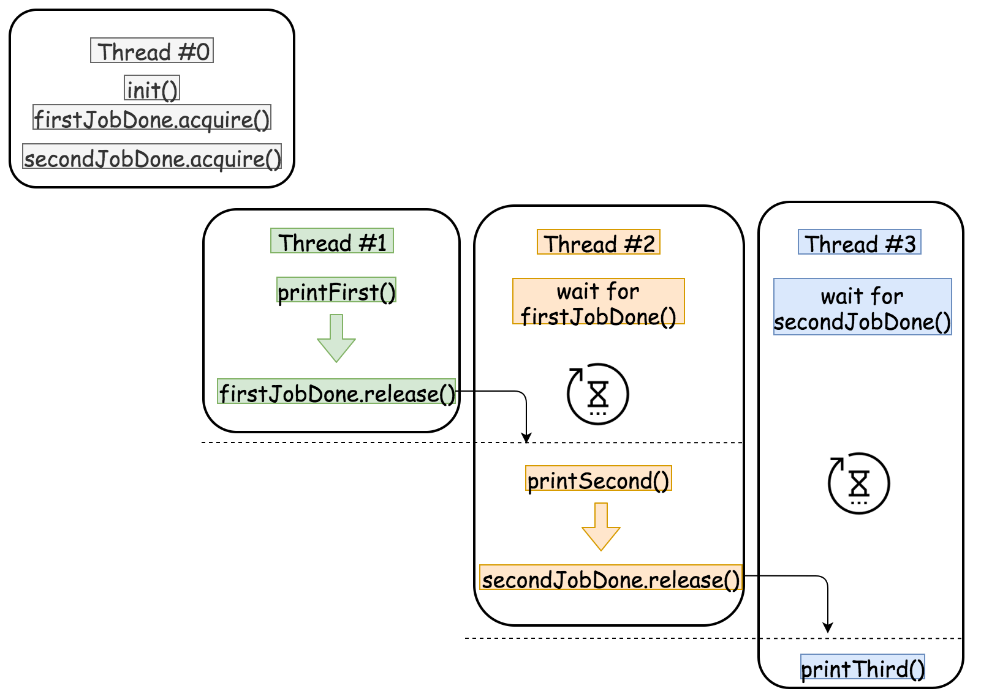

# Personal Try
## Java Concept: `CountDownLatch`
`CountDownLatch` allows you to block threads until the specified number of events (or tasks) have completed. You can configure each `Runnable` to wait for the previous one to complete by counting down the latch.

## Implementation
Sample usage.
```java
import java.util.concurrent.CountDownLatch;

public class SequenceRunnables {
    public static void main(String[] args) {
        CountDownLatch latch1 = new CountDownLatch(1);
        CountDownLatch latch2 = new CountDownLatch(1);

        Runnable task1 = () -> {
            System.out.println("Task 1 running");
            latch1.countDown(); // Let task2 proceed
        };

        Runnable task2 = () -> {
            try {
                latch1.await(); // Wait until task1 finishes
                System.out.println("Task 2 running");
                latch2.countDown(); // Let task3 proceed
            } catch (InterruptedException e) {
                Thread.currentThread().interrupt();
            }
        };

        Runnable task3 = () -> {
            try {
                latch2.await(); // Wait until task2 finishes
                System.out.println("Task 3 running");
            } catch (InterruptedException e) {
                Thread.currentThread().interrupt();
            }
        };

        // Starting all tasks simultaneously
        new Thread(task3).start();
        new Thread(task2).start();
        new Thread(task1).start();
    }
}

```

Here's what I do within the code. The method in `main` is made just to create to test for running the previous methods concurrently. I put `<latch>.countDown()` and `<latch>.await()` methods in proper places to make it wait for some `Runnable`s finished running, then execute the next one sequentially.
```java
package Problem1114PrintInOrder;

import java.util.concurrent.CountDownLatch;

class Foo {

    CountDownLatch firstDone = new CountDownLatch(1);
    CountDownLatch secondDone = new CountDownLatch(1);

    public Foo() {

    }

    public void first(Runnable printFirst) throws InterruptedException {
        // printFirst.run() outputs "first". Do not change or remove this line.
        printFirst.run();
        firstDone.countDown();
    }

    public void second(Runnable printSecond) throws InterruptedException {
        firstDone.await();
        // printSecond.run() outputs "second". Do not change or remove this line.
        printSecond.run();
        secondDone.countDown();
    }

    public void third(Runnable printThird) throws InterruptedException {
        secondDone.await();
        // printThird.run() outputs "third". Do not change or remove this line.
        printThird.run();
    }

    // helpers for printFirst printSecond and printThird

    public static class PrintFirst implements Runnable {
        @Override
        public void run() {
            System.out.print("first");
        }
    }

    public static class PrintSecond implements Runnable {
        @Override
        public void run() {
            System.out.print("second");
        }
    }

    public static class PrintThird implements Runnable {
        @Override
        public void run() {
            System.out.print("third");
        }
    }

    // Main method to run the example
    public static void main(String[] args) throws InterruptedException {
        Foo foo = new Foo();

        // Instantiate the static inner classes
        Runnable printFirst = new Foo.PrintFirst();
        Runnable printSecond = new Foo.PrintSecond();
        Runnable printThird = new Foo.PrintThird();

        Thread thread1 = new Thread(() -> {
            try {
                foo.first(printFirst);
            } catch (InterruptedException e) {
                Thread.currentThread().interrupt();
            }
        });

        Thread thread2 = new Thread(() -> {
            try {
                foo.second(printSecond);
            } catch (InterruptedException e) {
                Thread.currentThread().interrupt();
            }
        });

        Thread thread3 = new Thread(() -> {
            try {
                foo.third(printThird);
            } catch (InterruptedException e) {
                Thread.currentThread().interrupt();
            }
        });

        thread1.start();
        thread2.start();
        thread3.start();

    }
}
```

# Leetcode Editorial Solution
Basically, we need to have two locks for `first` and `second` method. Editorial gives `firstJobDone` and `secondJobDone` to indicate whether the `first` and `second` method is done or not.



# Tags: `Concurrency`, `CountDownLatch`