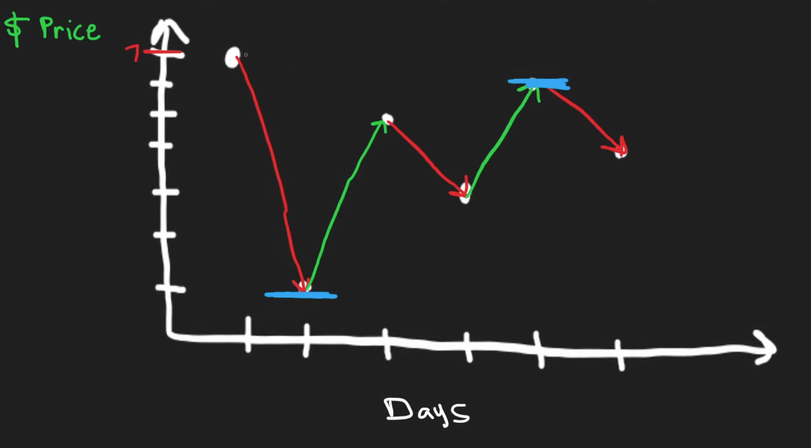
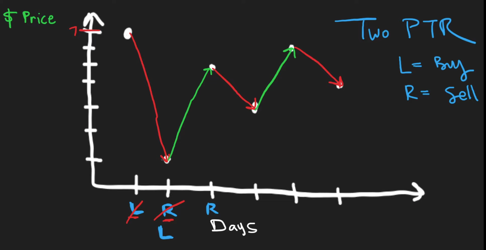
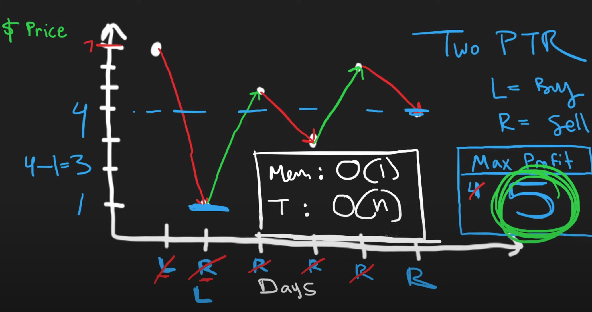
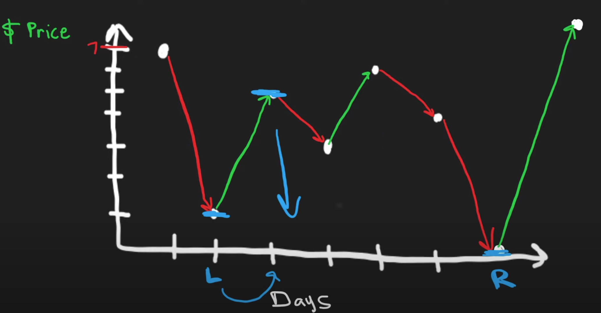

# Problems
## Problem 1: TLE
With this `O(n^2)` algorithm, it return a TLE.
```python
class Solution:
    def maxProfit(self, prices: List[int]) -> int:
        profit = 0

        for right in range(1, len(prices)):
            left = 0
            while left < right:
                profit = max(profit, prices[right] - prices[left])
                print(left, right, profit)
                left += 1
        return profit
```

# Neetcode Solution
Visual representation, for the logic, basically want to find the `min` and the `max` within the array


When profit is negative, we move both pointers `left` to be `right` and `right` to be `+1`. This means there is a smaller value in the future to buy from, which is located at `right`, in which the profit will always be greater than if we kept the `left` value to the current one.


When profit is not negative, we compare the `profit` with the previous max `profit`. Then, we can just move the right pointer to be `+1`.


My concern is what if there's a very low buy point, and a relativelly low sell point, like `prices = [7, 1, 5, 3, 6, 4, 0, 1]`, it will still move `left` to `right` as previously seen, but it will still compare the previous max `profit`, with current `profit`.


My interpretation of neetcode solution
```python
class Solution:
    def maxProfit(self, prices: List[int]) -> int:
        max_profit = 0
        right = 1
        left = 0

        while right < len(prices):
            if prices[right] - prices[left] > 0:
                max_profit = max(max_profit, prices[right] - prices[left])
            else:
                left = right

            right += 1

        return max_profit
```

It scans once only, thus it is `O(n)` time complexity.