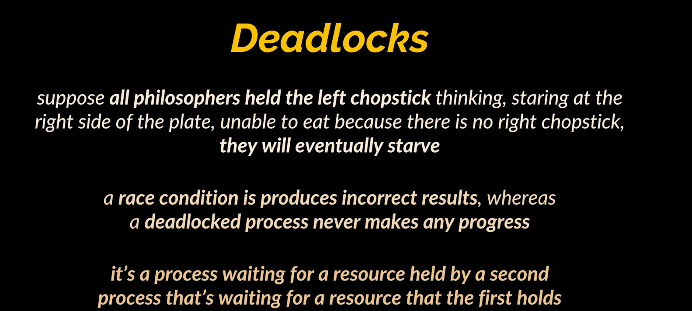
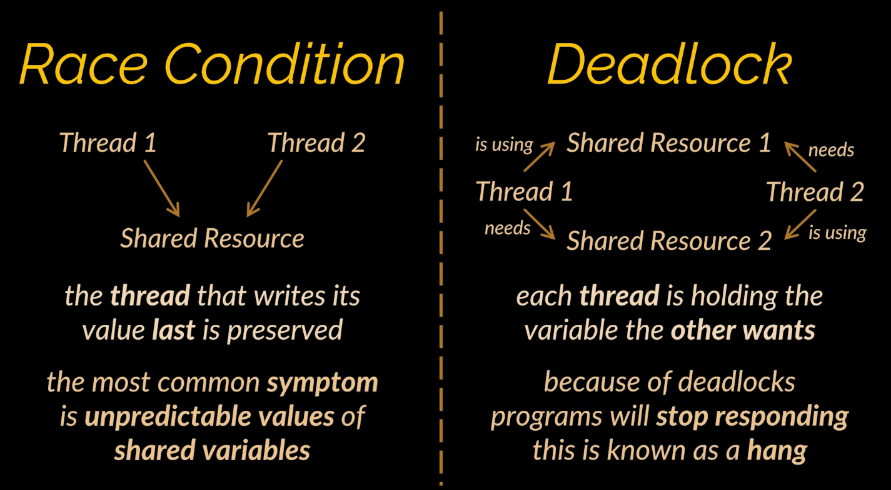

# SIDE NOTE: SEEMS LIKE LEETCODE GOT PROBLEM WITH THE SOLUTION

# [Video](https://www.youtube.com/watch?v=JEJdQN0mcG4) For Learning
This problem can cause **race conditions** and **deadlocks**. This is the case for **deadlock**. 


Here's the diff between **Deadlock** and **Race Condition**.


# Leetcode Solution from [Community 1](https://leetcode.com/problems/the-dining-philosophers/submissions/1414817753/)
Here's the whole code.
```java
package Problem1226TheDiningPhilosophers;

import java.util.concurrent.ExecutorService;
import java.util.concurrent.Executors;
import java.util.concurrent.Semaphore;

class DiningPhilosophers {
    Semaphore[] s;
    public DiningPhilosophers() {
        s = new Semaphore[5];
        for (int i = 0; i < 5; i++) {
            s[i] = new Semaphore(1);
        }
    }

    // call the run() method of any runnable to execute its code

    // keep in mind synchronized usage
    public synchronized void wantsToEat(int philosopher,
                                        Runnable pickLeftFork,
                                        Runnable pickRightFork,
                                        Runnable eat,
                                        Runnable putLeftFork,
                                        Runnable putRightFork) throws InterruptedException {

        s[philosopher].acquire(); // permission to run pickLeftFork
        s[(philosopher+1)%5].acquire(); // permission to run pickRightFork

        // actually picking up the forks
        pickLeftFork.run();
        pickRightFork.run();

        eat.run();

        putLeftFork.run();
        s[philosopher].release();
        putRightFork.run();
        s[(philosopher+1)%5].release();
    }


    public static void main(String[] args) {
        int n = 5; // Number of times each philosopher eats
        int philosophersCount = 5; // Number of philosophers

        DiningPhilosophers diningPhilosophers = new DiningPhilosophers();

        // Define the actions
        Runnable pickLeftFork = () -> System.out.println("PickLeftFork run");
        Runnable pickRightFork = () -> System.out.println("PickRightFork run");
        Runnable eat = () -> System.out.println("Eat run");
        Runnable putLeftFork = () -> System.out.println("PutLeftFork run");
        Runnable putRightFork = () -> System.out.println("PutRightFork run");

        // Create a fixed thread pool with the number of philosophers
        ExecutorService executorService = Executors.newFixedThreadPool(philosophersCount);

        // Submit tasks to the executor
        for (int i = 0; i < philosophersCount; i++) {
            int philosopher = i;
            executorService.submit(() -> {
                for (int j = 0; j < n; j++) {
                    try {
                        diningPhilosophers.wantsToEat(philosopher, pickLeftFork, pickRightFork, eat, putLeftFork, putRightFork);
                    } catch (InterruptedException e) {
                        Thread.currentThread().interrupt();
                        System.out.println("Thread was interrupted");
                    }
                }
            });
        }

        // Shutdown the executor service
        executorService.shutdown();
    }
}

```

Take a look at the portion I'm supposed to write.
```java
...
    Semaphore[] s;
    public DiningPhilosophers() {
        s = new Semaphore[5];
        for (int i = 0; i < 5; i++) {
            s[i] = new Semaphore(1);
        }
    }

    // call the run() method of any runnable to execute its code

    // keep in mind synchronized usage
    public synchronized void wantsToEat(int philosopher,
            Runnable pickLeftFork,
            Runnable pickRightFork,
            Runnable eat,
            Runnable putLeftFork,
            Runnable putRightFork) throws InterruptedException {

        s[philosopher].acquire(); // permission to run pickLeftFork
        s[(philosopher + 1) % 5].acquire(); // permission to run pickRightFork

        // actually picking up the forks
        pickLeftFork.run();
        pickRightFork.run();

        eat.run();

        putLeftFork.run();
        s[philosopher].release(); // allow other philosopher to get permission to run with fork on `philosopher`
        putRightFork.run();
        s[(philosopher + 1) % 5].release();
    }
...
```

Keep `5` new `Semaphores` each in `s[i]`, to indicate whether fork number `i` is available to be picked up or not. Keep in mind that philosopher `i` needs to use fork `i` and fork `i+1` (or `(i+1)%5`) to as forks to eat their food. 

Turns out solusi paling goblok just use the `synchronized`, no need semaphores.
```java
...
    // call the run() method of any runnable to execute its code
    public synchronized void wantsToEat(int philosopher,
            Runnable pickLeftFork,
            Runnable pickRightFork,
            Runnable eat,
            Runnable putLeftFork,
            Runnable putRightFork) throws InterruptedException {

        // actually picking up the forks
        pickLeftFork.run();
        pickRightFork.run();

        eat.run();

        putLeftFork.run();
        putRightFork.run();
    }
...
```

Without `synchronized` keyword this solution doesn't work.

# Different Implementation - Different Usage but Similar Context Problem
```java
public class DiningPhilosophers {

    // Array to represent the availability of forks.
    private final Object[] forks;

    public DiningPhilosophers(int numPhilosophers) {
        forks = new Object[numPhilosophers];
        // Initialize each fork as a separate object.
        for (int i = 0; i < numPhilosophers; i++) {
            forks[i] = new Object();
        }
    }

    // Philosopher thread class
    private class Philosopher extends Thread {
        private final int id;
        private final int leftFork;
        private final int rightFork;

        public Philosopher(int id) {
            this.id = id;
            leftFork = id;
            rightFork = (id + 1) % forks.length;
        }

        @Override
        public void run() {
            while (true) {
                think();
                eat();
            }
        }

        // Method for philosopher to 'think'
        private void think() {
            System.out.println("Philosopher " + id + " is thinking.");
            try {
                Thread.sleep((int)(Math.random() * 1000));
            } catch (InterruptedException e) {
                Thread.currentThread().interrupt();
            }
        }

        // Method for philosopher to 'eat'
        private void eat() {
            // Lock both forks using synchronized blocks to avoid deadlock.
            Object firstFork = forks[Math.min(leftFork, rightFork)];
            Object secondFork = forks[Math.max(leftFork, rightFork)];

            synchronized (firstFork) {
                synchronized (secondFork) {
                    System.out.println("Philosopher " + id + " is eating.");
                    try {
                        Thread.sleep((int)(Math.random() * 1000));
                    } catch (InterruptedException e) {
                        Thread.currentThread().interrupt();
                    }
                }
            }
            System.out.println("Philosopher " + id + " has finished eating.");
        }
    }

    public void startDining() {
        Philosopher[] philosophers = new Philosopher[forks.length];
        for (int i = 0; i < forks.length; i++) {
            philosophers[i] = new Philosopher(i);
            philosophers[i].start();
        }
    }

    public static void main(String[] args) {
        int numPhilosophers = 5; // Number of philosophers (and forks)
        DiningPhilosophers diningPhilosophers = new DiningPhilosophers(numPhilosophers);
        diningPhilosophers.startDining();
    }
}
```