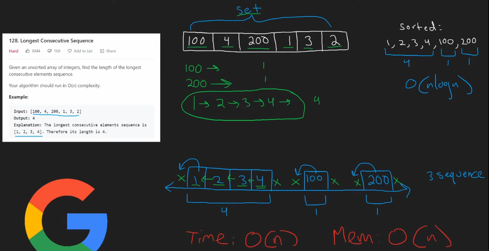

# Notes
## You Can't Sort
Since it requires `O(n)` solution, we can't use any kind of sorting, as the fastest complexity for sorting with mergesort, is `O(n log n)`.

# Neetcode Solution
Input here is `nums = [int(*), int(*), ...]`, so when encountering a number, most important thing to do here is check for 3 things, whether the number is ...
1. Start of a sequence (left neighbour exist, `num-1` exist)
2. End of a sequence (right neighbour exist, `num+1` exist)

Keep in mind similar to a the picture below, every `num` in `nums`, will be able to form a consecutive sequence, with at least one element inside the sequence (`num` itself). But a few `num`s can make a consecutive sequence also. So, we need to find the sequences available (and more importantly the length of the sequence).



Here's the TODO on this
1. Create `numSet = set(nums)`, transforming `nums` to a `set`
2. for each `num` in `nums`
    - if `num` is start of a sequence (has no left neighbour, `num-1` not in `numSet`)
        - YES → Check, if `num` not end of sequence (has left neighbour, `num+1` in `numSet`)
            - YES → add `+1` to `length`, REPEAT check if `num+1` not end of sequence (USE WHILE LOOP)
            - NO → compare with previously stored `maxlength`, assign `maxlength = max(length, maxlength)`
        - NO → CONTINUE dunnid to do anything


This is my code interpretation for this code.
```python
class Solution:
    def longestConsecutive(self, nums: List[int]) -> int:
        numSet = set(nums)
        maxlength = 0

        for num in nums:
            if num-1 not in numSet:  # start of sequence
                length = 1
                while num+1 in numSet:  # not end of sequence
                    length += 1
                    num = num+1
                # reached the end of sequence, whether is it the same number or not
                maxlength = max(length, maxlength)
            # num-1 in numSet means it is not start of sequence and we can ignore it

        return maxlength
```