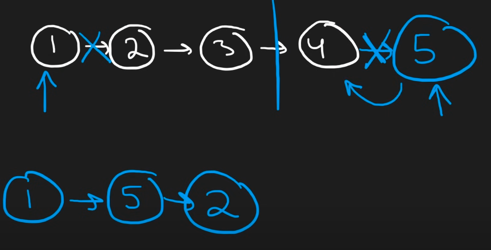

# Scribbles
## Scribble 1
```
1 -> 2 -> 3 -> 4 -> 5
^
n1
```
`n = 0`
Can go until the end

`(1).next => (2)` &rarr; n = 0 + 1 = 1
    `(2).next => (3)` &rarr; n = 1 + 1 = 2
        `(3).next => (4)` &rarr; n = 2 + 1 = 3
            `(4).next => (5)` &rarr; n = 3 + 1 = 4
                `(5).next => (None)` &rarr; n = 4 + 1 = 5

I got the `n` already &rarr; `maxIndex = n-1`.
Two pointers `nodeL` and `nodeR`.`

`nodeL` just moves accordingly but how about `nodeR`?

Everytime we finish an operation of moving for 1 `<start-end>` pair, we add `c += 1`, then starting from `nodeL` do `.next` sebanyak `2*c-1` times, that's the value of `nodeR` we want.

Then with these two nodes, we want to do, in this order
- `nodeR.next = nodeL.next` point 5 -> 2
- `nodeL.next = nodeR` point 1 -> 5
- `nodeL = nodeL.next.next` move `nodeL` from 1 to 5 to 2

# Problems
## Problem 1: The code doesn't work for even length lists
This code
```python
class Solution:
    def reorderList(self, head: Optional[ListNode]) -> None:
        """
        Do not return anything, modify head in-place instead.
        """

        n = 0
        nodeCounter = head
        while nodeCounter != None:
            n += 1
            nodeCounter = nodeCounter.next

        c = 0

        nodeL = head
        while n - 2*c - 1 != 0:

            nodeR = nodeL
            for i in range(n - 2*c - 1):
                nodeR = nodeR.next

            nodeR.next = nodeL.next
            nodeL.next = nodeR
            nodeL = nodeL.next.next

            c += 1
        return
```
Loop Condition: The condition while n - 2*c - 1 != 0 may not correctly determine when to stop the loop. This condition will fail to stop the loop when n is even, and c reaches n/2 - 1.

## Problem 2: Error Even After Following Neetcode with my addition
```python
class Solution:
    def reorderList(self, head: Optional[ListNode]) -> None:
        """
        Do not return anything, modify head in-place instead.
        """
        # slow fast, to find middle
        slow = head
        fast = head.next

        while fast != None and fast.next != None:
            slow = slow.next
            fast = fast.next.next

        # reverse list for second half
        # slow.next because, slow is still at the last element of first list
        second_list = self.reverseList(slow.next)

        first_list = head

        while second_list != None or first_list != None:
            # store original next values
            original_first_list_next = first_list.next
            original_second_list_next = second_list.next

            # reorder the values first
            first_list.next = second_list
            second_list.next = original_first_list_next

            # set the first and second list pointer to the values they previously should hold before re-ordering
            first_list = original_first_list_next
            second_list = original_second_list_next

        return

    # copy reverseList from leetcode Problem206
    def reverseList(self, head: Optional[ListNode]) -> Optional[ListNode]:
        if head == None:
            return head

        if head.next == None:
            return head

        node1 = head
        node2 = None

        while node1.next != None:
            nodePrev = node2

            node2 = node1

            node1 = node1.next

            node2.next = nodePrev

        # don't forget to set the final node, to the node2
        node1.next = node2

        return node1
```
Your Code: You use a helper function `reverseList()` for reversing, but the logic of your reverse function is flawed. Specifically:
Your code doesn’t update node1 correctly in each iteration, leading to potential mislinks. The condition while `node1.next != None` in your reversal logic assumes that the next node will always exist, which can break when you reach the last element. The reversal also doesn’t handle setting the head pointer correctly at the end, which might lead to errors like null pointer dereferencing.


# Neetcode Solution
In short, neetcode's solution tells us to go to the half point, then reverse the second half of the list, then use two pointers like the following picture.


