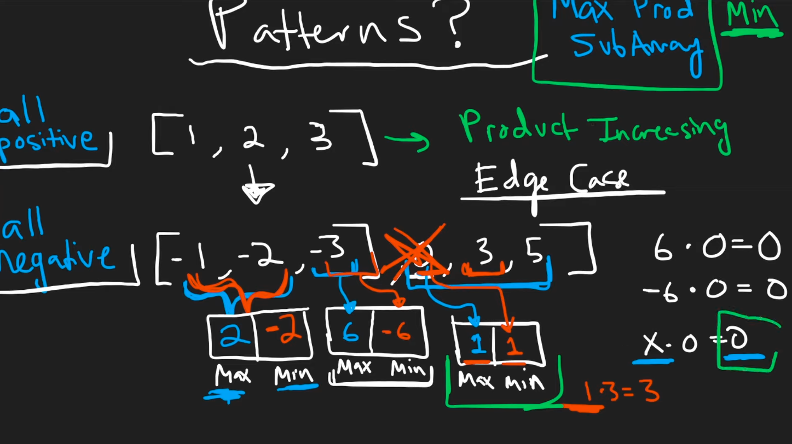

# Thought Process
## When is the right pointer moved?
`max_pr = 0`
```
2 3 -2 4
^
l,r
```
`pr = nums[l] * ... * nums[r] = 2`


```
2 3 -2 4
^ ^
l r
```
`pr = nums[l] * ... * nums[r] = prev_pr * nums[r] = 2 * 3 = 6`
`max_pr = 6`

```
2 3 -2 4
^ ^
l r
```


# Neetcode


