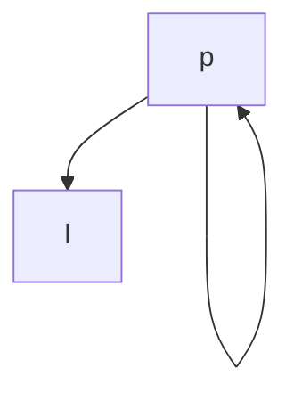

# Thought Process
We can implement it like a normal graph I think, using adjacency list.
```python
graph = {
    ...,
    "a": ["p","l"],
    "<curr-letter>": [...,"<next-letter-i>",...]
    ...,
}

```

However, we not only need to store the list, Neetcode says we need to store a `isEnd` property for each letter. To check whether that word exist or not.

# TIL
## DefaultDict Custom Data Structure
Using this structure must use `lambda` function to return the structure.
```python
...
        graph = defaultdict(lambda: {"children": [], "isEnd": False})
...
```

# Problems
## Problem 1: Implementing as a Graph
```python
class Trie:

    def __init__(self):
        # strores { "a" : {"next_letter": ["p"] , is_end: False} }
        self.graph = defaultdict(
            lambda: {"next_letter": [], "is_end": False})
        return

    def insert(self, word: str) -> None:
        for idx, letter in enumerate(word):
            if idx == len(word) - 1:  # last letter
                self.graph[letter]["is_end"] = True
            else:  # not last letter
                self.graph[letter]["next_letter"].append(word[idx+1])

        print(self.graph)
        return

    def search(self, word: str) -> bool:
        return

    def startsWith(self, prefix: str) -> bool:
        return
```

When you implement it as a graph like this, it is going to be difficult when handling similar letters like 
```
➜  Problem208ImplementTrie git:(problem-208-implement-trie) ✗ python3 trie.py
defaultdict(<function Trie.__init__.<locals>.<lambda> at 0x102a15800>, {'a': {'next_letter': ['p'], 'is_end': False}, 'p': {'next_letter': ['p', 'l'], 'is_end': False}, 'l': {'next_letter': ['e'], 'is_end': False}, 'e': {'next_letter': [], 'is_end': True}})
```

See that the `'p': ['p', 'l']`, making the graph look like.


So instead we should implement a `TrieNode`, coz it can keep two similar letters at different objects (different identifiers).


## Problem 2: `is_end` assigning problem
```python
class TrieNode:
    def __init__(self, letter=None):
        self.letter = letter
        self.next_letters: set[Optional[TrieNode]] = set()
        self.is_end = False

    def __str__(self):
        return self._str_helper(0)

    def _str_helper(self, level):
        result = "  " * level + \
            f"letter: {self.letter}, is_end: {self.is_end}\n"
        for child in self.next_letters:
            result += child._str_helper(level + 1)
        return result


class Trie:

    def __init__(self):
        # strores { "a" : {"next_letter": ["p"] , is_end: False} }
        self.root = TrieNode()
        return

    def insert(self, word: str) -> None:
        prevLetterNode: TrieNode = self.root
        for idx, letter in enumerate(word):
            letterNode: TrieNode = TrieNode(letter)

            prevLetterNode.next_letters.add(letterNode)
            if idx == 0:
                prevLetterNode = letterNode
            elif idx == len(word) - 1:
                letterNode.is_end = True
            else:  # in the middle
                prevLetterNode = letterNode

        # print(self.root)
        return

    def search(self, word: str) -> bool:
        searchNode = self.root
        # print(searchNode)

        for idx, queryLetter in enumerate(word):
            for idx_nextNode, nextNode in enumerate(searchNode.next_letters):
                if queryLetter == nextNode.letter:
                    searchNode = nextNode

                    if idx == len(word)-1:
                        print("check")
                        return searchNode.is_end
                # tydack sama dan sudah terakhir
                elif idx_nextNode == len(searchNode.next_letters)-1:
                    return False  # no nextNode matches query Letter

        return

    def startsWith(self, prefix: str) -> bool:
        searchNode = self.root
        # print(searchNode)

        for idx, queryLetter in enumerate(prefix):
            for idx_nextNode, nextNode in enumerate(searchNode.next_letters):
                if queryLetter == nextNode.letter:
                    searchNode = nextNode

                    if idx == len(prefix)-1:  # prefix is included inside the Trie structure
                        return True
                # tydack sama dan sudah terakhir
                elif idx_nextNode == len(searchNode.next_letters)-1:
                    return False  # no nextNode matches query Letter

        return
```

This test case gives `False` even though it has to be `True`. After checking for `print("check")` I noticed that it prints out the `check` and returns `False`. Means, it is a problem with how I assigned `is_end`.


Problem is here
```python
...
    def insert(self, word: str) -> None:
        prevLetterNode: TrieNode = self.root
        for idx, letter in enumerate(word):
            letterNode: TrieNode = TrieNode(letter)

            prevLetterNode.next_letters.add(letterNode)
            if idx == 0:
                prevLetterNode = letterNode
            elif idx == len(word) - 1:
                print("check is_end", idx)
                letterNode.is_end = True
            else:  # in the middle
                prevLetterNode = letterNode
...
```

When `insert` is run and it is at `idx==0` it doesn't go through the `idx == len(word) - 1` even though it is the last word.

# Neetcode
Neetcode's solution no need so mafan.
```python
class Trie:

    def __init__(self):
        # strores { "a" : {"next_letter": ["p"] , is_end: False} }
        self.root = TrieNode()
        return

    def insert(self, word: str) -> None:
        cur: TrieNode = self.root
        for c in word:
            if c not in cur.children:
                cur.children[c] = TrieNode()  # get from dictionary
            cur = cur.children[c]  # retrieve the TrieNode()
        cur.isEnd = True  # the last one will get isEnd

        # print(self.root)
        return

    def search(self, word: str) -> bool:
        cur = self.root
        # print(searchNode)

        for c in word:
            if c not in cur.children:
                return False
            # just normally traverse the tree until the end of the `word`
            cur = cur.children[c]

        return cur.isEnd

    def startsWith(self, prefix: str) -> bool:
        # same logic but less strict than search
        cur = self.root
        # print(searchNode)

        for c in prefix:
            if c not in cur.children:
                return False
            # just normally traverse the tree until the end of the `word`
            cur = cur.children[c]

        return True
```

logic is simple, but use the proper data structure, don't overcomplicate the `TrieNode` structure esp.

 