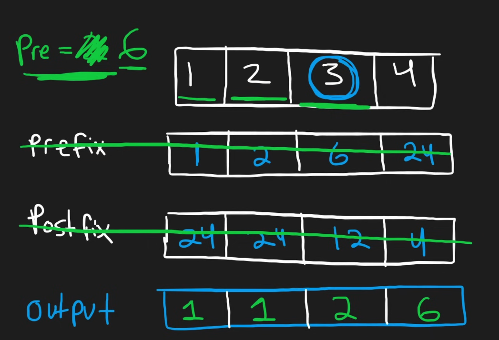
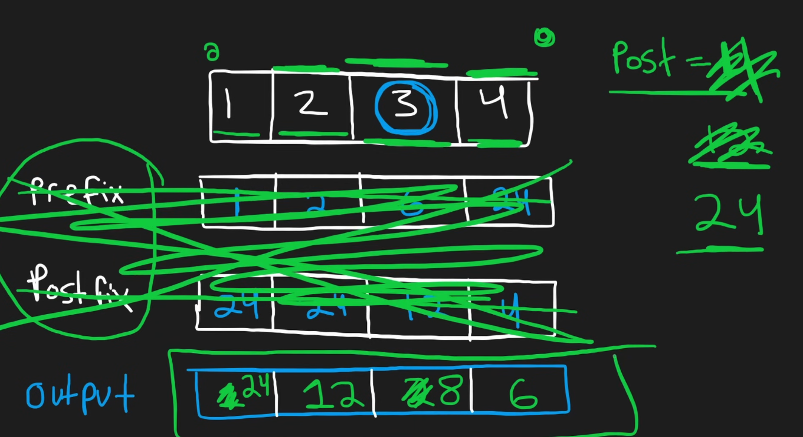

# Problems
## Problem 1: Time Limit Exceeded
The most stupid solution is to run it in `O(n^2)`.
```python
class Solution:
    def productExceptSelf(self, nums: List[int]) -> List[int]:
        # start of with O(n^2) solution
        res = [1 for _ in range(len(nums))]

        for i in range(len(nums)):
            for j in range(len(nums)):
                if i != j:
                    res[i] *= nums[j]

        return res
```

So we need to find another solution.

# Neetcode Solution
## Solution V1
use a `prefix` and `postfix` arrays, where `prefix[i] = prefix[0] * ... * prefix[i])` and `postfix[i] = postfix[i] * ... * postfix[n-1]`. Then, `result[i] = prefix[i-1] * postfix[i+1]`. I want to code this solution out first.


```python
class Solution:
    def productExceptSelf(self, nums: List[int]) -> List[int]:
        prefix = [1 for i in range(len(nums))]
        postfix = [1 for i in range(len(nums))]

        for i in range(len(nums)):
            if i > 0:  # after first element
                prefix[i] = prefix[i-1] * nums[i]
            else:
                prefix[i] = nums[i]

        for i in range(len(nums)-1, -1, -1):
            if i >= len(nums) - 1:
                postfix[i] = nums[i]
            else:
                postfix[i] = nums[i] * postfix[i+1]

        res = [1 for i in range(len(nums))]
        for i in range(len(nums)):
            if i <= 0:
                res[i] = postfix[i+1]
            elif i >= len(nums)-1:
                res[i] = prefix[i-1]
            else:
                res[i] = prefix[i-1] * postfix[i+1]
        return res
```

This solution runs, but can still be optimized for `O(1)` memory.

## Solution V2
Store the `prefix` and `postfix` in the form of an `int`. We will run two rounds from index `0` to `n`, and from `n` to `0`. For ascending index, we store `prefix`. For descending index, we store `postfix`.

Keep in mind that doing this is similar to doing the `prefix` and `postfix` array, but instead of calculating both `prefix` and `postfix` then multiplying it in the `output`, we just need to directly keep the `prefix` multiplication result inside the `output` directly, while doing another round of iteration again for the `postfix` multiplication.

Here's the TODO
1. Initialize `prefix = 1`, this will be the value that stores the `prefix` multiplication values at each iteration `i`
2. Start iterating inside `output = [...]` for calculating the `prefix`. For index `0`, since it doesn't have a prefix, we put the initial value `output[0] = prefix` which is 1. Then for subsequent index `>0` or `1, ..., n-1`, we have to update `prefix = prefix * nums[i-1]`, means it now contains the multiplied value of the previous `prefix` as well as at `i-1`. Then, do `output[i] = prefix`.
3. Initialize `postfix = 1`, this will act similarly to `prefix` in the previous iteration.
4. Start iterating (from the back, index `n-1`) inside `output = [1, 1 * nums[0], 1 * nums[0] * nums[1], ..., 1 * nums[0] * ... * nums[i-1]]`. KEEP IN MIND `output` already has the prefix multiplication values. For index `n-1`, doesn't have a postfix, so we use initial value `output[n-1] = output[n-1] * postfix (which is 1)`. Then for subsequent index `<n-1`, we update `postfix = postfix * nums[i+1]`. Then, we do `output[i] = output[i]*postfix`. With this, `output` will contain the multiplication values of all elements except for `i`.

Visualize solution



Here's the code
```python
class Solution:
    def productExceptSelf(self, nums: List[int]) -> List[int]:
        n = len(nums)
        output = [1] * n

        prefix = 1
        for i in range(n):
            if i > 0:
                prefix = prefix * nums[i-1]
            output[i] = output[i] * prefix

        postfix = 1
        for i in range(n-1, -1, -1):
            if i < n-1:
                postfix = postfix * nums[i+1]
            output[i] = output[i] * postfix

        return output
```