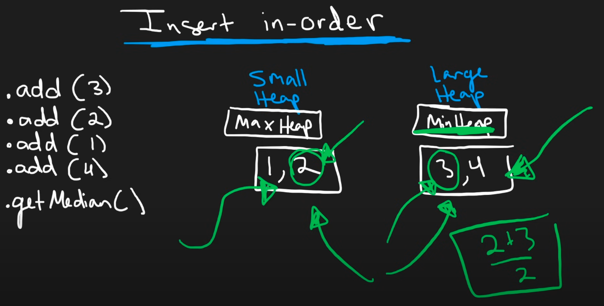

# Thought Process
I didn't find any ideas for this

# Neetcode Solution
To get median value, we need to define 2 heaps, `small_heap` for storing the small values (first half smallest values), and `large_heap` for storing last half biggest values. Then in simplicity (when it is even `n`), take the `max_heap_value` of `small_heap` and `min_heap_value` of `large_heap`, then average them to get `median`. For odd `n` just keep one greater (for example fill `small_heap` first), then the `median` would be `max_heap_value`.


Before seeing neetcode's implementation, but after seeing the picture, here's my code
```python
class MedianFinder:

    def __init__(self):
        # max_heap (negate values to work with library) # fill this up first, so might only be bigger by 1 at most
        self.small_heap = []
        self.large_heap = []  # min_heap
        self.total_elems = 0
        return

    def addNum(self, num: int) -> None:
        self.total_elems += 1

        if len(self.small_heap) == 0:  # large_heap also 0
            heapq.heappush(self.small_heap, -num)
        elif len(self.small_heap) - len(self.large_heap) >= 1:  # diff = 0
            # just add to small_heap (with adjustments)

            # this value should still be smaller than smallest value in large_heap min_heap
            max_overflow_small_heap = -heapq.heappushpop(self.small_heap, -num)
            heapq.heappush(self.large_heap, max_overflow_small_heap)
        elif len(self.small_heap) == len(self.large_heap):
            min_overflow_large_heap = heapq.heappushpop(self.large_heap, num)
            heapq.heappush(self.small_heap, -min_overflow_large_heap)

        # print(self.small_heap, self.large_heap)

        return

    def findMedian(self) -> float:
        if self.total_elems % 2:
            # true --> 1 --> odd
            return -self.small_heap[0]
        else:
            return (-self.small_heap[0] + self.large_heap[0])/2
```

Basically, my logic means...
- if both `small_heap` and `large_heap` are same size &rarr; we want to fill in `small_heap`, means we have to add to `large_heap` then pop `large_heap`'s new smallest value, and append it to `small_heap`. Keep in mind that `<large_heap-new-smallest-value> >= <small_heap-biggest-value>`.
- if `small_heap` is bigger than `large_heap` by one &rarr; we want to fill in `large_heap`, means we have to add to `small_heap` then pop `small_heap`'s new biggest value, and append it to `large_heap`. Keep in mind that `<small_heap-new-biggest-value> <= <large_heap-smallest-value>`.