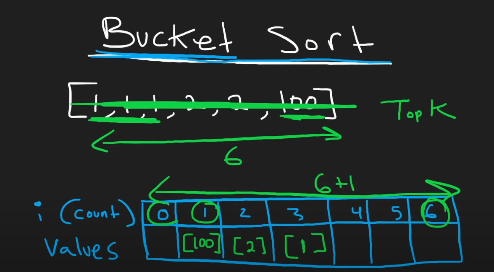

# TIL
## TIL 1: Declaring `defaultdict(...)`
The argument inside `defaultdict(...)` has to be a function, so you can't do `defaultdict(0)`, but have to be `defaultdict(lambda: 0)`.

## TIL 2: Sorting Hash Keys based on Corresponding values
Using the line in 
```python
...
        return sorted(hash.keys(), key=lambda hash_key: hash[hash_key], reverse=True)[0:k]
...
```
We can sort `hash.keys()`, by calling the value `hash[hash_key]` is the value used to compare against each other.

# Problems
## Problem 1: Empty List Refers to Same Memory Address
```python
class Solution:
    def topKFrequent(self, nums: List[int], k: int) -> List[int]:
        # track for key (the num inside nums) : value (number of appearances)
        hash = defaultdict(lambda: 0)  # default value be 0
        counts = [[]] * (len(nums)+1)  # default value be []

        for num in nums:
            hash[num] += 1

        print(hash.items())
        for num, count in hash.items():
            print(count)
            print(counts[count])
            counts[count].append(num)
            print(counts)

        res = []
        for i in range(len(nums), -1, -1):
            # i start from n
            # counts[i] is a list
            for num in counts[i]:
                res.append(num)

        print(counts)
        print(res)

```

When I do this, in this line
```python
...
        counts = [[]] * (len(nums)+1)  # default value be []
...
```
all the empty arrays `[]` refers to same memory addresses, so when I run append inside
```python
...
        for num, count in hash.items():
            print(count)
            print(counts[count])
            counts[count].append(num)
            print(counts)
...
```
it will append to every array `[]` inside `counts`.

Solution is to initialize with
```python
...
        counts = [[] for _ in range(len(nums)+1)]  # default value be []
...
```

# Neetcode Solution
Uses bucket sort, can solve in `O(n)` time, my solution solved in it `O(n log n)` time.

Here's the drawing of the solution, the key here, is to have an array `counts` with index be frequency of appearance, and values be the list of elements which appears index-number of times. If the size of input elements is `n`, we only need to initialize the `counts` array with index `0` until `n` inclusive, as at most the same element could appear `n` times maximum.


So here's the todo...
1. Initialize `counts` with elements being empty arrays `[]`.
2. For each `num` in input `nums` do `hash[num] += 1`, basically record the number of appearances inside the `hash`
3. Then insert the value inside the `counts` array, so if the key-value pair in `hash` is `{num_i: count}` do `counts[count] = [...<all-corresponding-num_i>...]`.
4. Then iterate from the biggest index in `counts`, take only `k` elements.
5. return this `k` elements

Here's my interpretation on the solution, I write the code myself.
```python
class Solution:
    def topKFrequent(self, nums: List[int], k: int) -> List[int]:
        # track for key (the num inside nums) : value (number of appearances)
        hash = defaultdict(lambda: 0)  # default value be 0
        counts = [[] for _ in range(len(nums)+1)]  # default value be []

        for num in nums:
            hash[num] += 1

        for num, count in hash.items():
            counts[count].append(num)

        res = []
        for i in range(len(nums), -1, -1):
            # i start from n
            # counts[i] is a list
            for num in counts[i]:
                res.append(num)
                if len(res) == k:  # reaches k most freq element already
                    return res
```