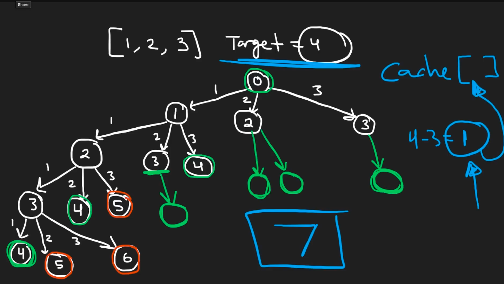
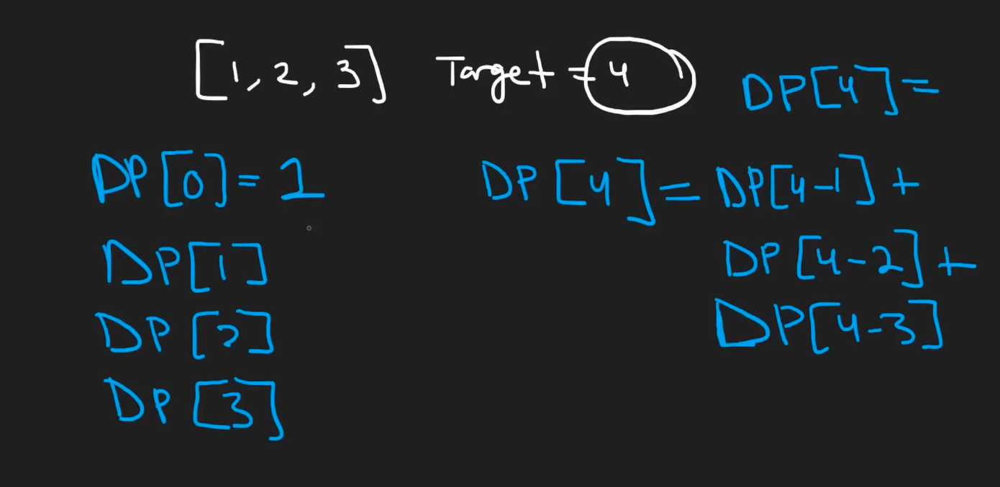

# Idea of Solving
## Recursion can be used for this
Given a `target`, and a list of numbers `nums = [nums[0], ..., nums[n-1]]`. We can brute force add up the numbers until we reach the target.

Here's what we can do, for `i, j, k,... = 0, ..., n-1`

CASE 1: `nums[i] + nums[j] + nums[k] + ... = target` &rarr; add `+1` to `counter`.

OR

CASE 2: `nums[i] + nums[j] + nums[k] + ... > target` &rarr; break but no need to add anything.

OR 

CASE 3: `nums[i] + nums[j] + nums[k] + ... < target` &rarr; add more numbers `nums[l]` until it reaches CASE 1 or CASE 2

## Problems
# Problem 1: Wrong Logic
```python
class Solution:
    def combinationSum4(self, nums: List[int], target: int) -> int:
        counter = 0

        sum = 0

        def recursion(nums, target, sum, counter, arr_sum=[]):  # return integer
            if sum == target:
                # end recursion
                return counter + 1
            if sum > target:
                # end recursion
                return counter
            else:  # sum < target
                for i in range(len(nums)):
                    arr_sum.append(nums[i])
                    print('arr_sum ', arr_sum)
                    return recursion(nums, target, sum+nums[i], counter, arr_sum)

        return recursion(nums, target, sum, counter)

```

The loop is supposed to iterate over all number in `nums`, but since it returns inside the loop, with this line,
```python
                    return recursion(nums, target, sum+nums[i], counter, arr_sum)
```
we only receive the first iteration only.

This is the code fixed by ChatGPT
```python
class Solution:
    def combinationSum4(self, nums: List[int], target: int) -> int:

        sum = 0

        def recursion(nums, target, sum):  # return integer
            if sum == target:
                # end recursion
                return 1
            if sum > target:
                # end recursion
                return 0

            counter = 0
            for i in range(len(nums)):
                counter += recursion(nums, target, sum + nums[i])
            return counter

        return recursion(nums, target, sum)
```

A FEW NOTES
1. `sum + nums[i]` acts as the new sum of that ongoing iteration.
2. Why do we put the `counter = 0` within the `recursion` function, not outside? 
    - We don't want `counter` shared across recursive calls
    - What we want is a local `counter` for each sub-branch, as the sub-branches `counter` values will all be added in the top branch through `counter += recursion(nums, target, sum + nums[i])`, and returned afterwards `return counter`

Same logic but more readable code
```python
class Solution:
    def combinationSum4(self, nums: List[int], target: int) -> int:

        sum = 0

        def recursion(nums, target, sum):  # return integer
            if sum == target:
                # end recursion
                return 1
            elif sum > target:
                # end recursion
                return 0
            else:
                counter = 0
                # all addition procedure for the `counter` lies here
                for i in range(len(nums)):
                    counter += recursion(nums, target, sum + nums[i])

                # it is finished adding all values for `counter`
                return counter  # sum < target

        return recursion(nums, target, sum)
```

## Problem 2: TLE, need hashing
Before I hash
```python
class Solution:
    def combinationSum4(self, nums: List[int], target: int) -> int:

        sum = 0

        def recursion(nums, target, sum):  # return integer
            if sum == target:
                # end recursion
                return 1
            elif sum > target:
                # end recursion
                return 0
            else:
                counter = 0
                # all addition procedure for the `counter` lies here
                for i in range(len(nums)):
                    counter += recursion(nums, target, sum + nums[i])

                # it is finished adding all values for `counter`
                return counter  # sum < target

        return recursion(nums, target, sum)
```

Here is the new code with hashing, this passes leetcode solution.
```python
class Solution:
    def combinationSum4(self, nums: List[int], target: int) -> int:

        sum = 0
        hash = {}  # contains {sum: counter}

        def recursion(nums, target, sum):  # return integer
            if sum in hash:
                return hash[sum]
            elif sum == target:
                # end recursion
                return 1
            elif sum > target:
                # end recursion
                return 0
            else:
                counter = 0
                # all addition procedure for the `counter` lies here
                for i in range(len(nums)):
                    counter += recursion(nums, target, sum + nums[i])

                # it is finished adding all values for `counter`
                hash[sum] = counter
                return counter  # sum < target

        return recursion(nums, target, sum)
```

## Problem 3: Function looks nasty AF NGL
This is the initial way it looks
```python
class Solution:
    def combinationSum4(self, nums: List[int], target: int) -> int:

        sum = 0
        hash = {}  # contains {sum: counter}

        def recursion(nums, target, sum):  # return integer
            if sum in hash:
                return hash[sum]
            elif sum == target:
                # end recursion
                return 1
            elif sum > target:
                # end recursion
                return 0
            else:
                counter = 0
                # all addition procedure for the `counter` lies here
                for i in range(len(nums)):
                    counter += recursion(nums, target, sum + nums[i])

                # it is finished adding all values for `counter`
                hash[sum] = counter
                return counter  # sum < target

        return recursion(nums, target, sum)
```

Just need to make it neater by separating both functions
```python
class Solution:
    def combinationSum4(self, nums: List[int], target: int) -> int:

        sum = 0
        hash = {}  # contains {sum: counter}

        return self.recursion(nums, target, sum, hash)

    def recursion(self, nums, target, sum, hash):  # return integer
        if sum in hash:
            return hash[sum]
        elif sum == target:
            # end recursion
            return 1
        elif sum > target:
            # end recursion
            return 0
        else:
            counter = 0
            # all addition procedure for the `counter` lies here
            for i in range(len(nums)):
                counter += self.recursion(nums, target, sum + nums[i], hash)

            # it is finished adding all values for `counter`
            hash[sum] = counter
            return counter  # sum < target
```

## Problem 4: incorrect logic, after applying neetcode solution
```python
class Solution:
    def combinationSum4(self, nums: List[int], target: int) -> int:
        hash = {0: 1}  # base case listed inside

        for leftover_sum in range(1, target+1):
            hash[leftover_sum] = 0

            # subtract it with all the possible value in `nums`
            for subtraction_num in nums:
                new_leftover_sum = leftover_sum - subtraction_num
                if new_leftover_sum < 0:  # base case 1
                    hash[new_leftover_sum] = 0
                elif new_leftover_sum == 0:
                    hash[leftover_sum] += hash[new_leftover_sum]

        return hash[target]
```

Based on ChatGPT, the mistake here is.

1. Only Considering new_leftover_sum == 0:

```python
                elif new_leftover_sum == 0:
                    hash[leftover_sum] += hash[new_leftover_sum]
```
This condition only adds to hash[leftover_sum] when new_leftover_sum is exactly zero.
It ignores all other valid sums where new_leftover_sum is greater than zero.

# Neetcode Solution
Uses bottom-up dp, instead of top-down like my method. Having a cache `hash` with values of `{ <what-is-remaining-until-target> : <counter-of-number-of-ways-to-get-to-target-from-sum>}`

The caching concept is here, what to cache.


Logic for the base case, and how we work around the logic. Base case being `hash[0] = 1`, if we need 0 more sum to get to target, means we reached `target` already, and showing that there's `1` way to get there. Another base case similar to my previous code is, `hash[<0] = 0` as this means that this sum doesn't add up to `target`. 

`hash[value] = x` in this case means that there are `x` ways to get to `target` from `value` given possible summations of every number available in `nums`.



With the given case in the picture, here is the breakdown
```
hash[4] = hash[4-3] + hash[4-2] + hash[4-1]
        = hash[1] + hash[2] + hash[3]
        = ... calculate each one

hash[1] = hash[1-1] + hash[1-2] + hash[1-3]
        = hash[0] <base-case> + hash[-1] + hash hash[-2]
        = 1 + 0 + 0 = 1

hash[2] = hash[2-1] + hash[2-2] + hash[2-3]
        = hash[0] <base-case> + hash[1] <calculated-before> + hash[-1]
        = 1 + 1 + 0 = 2

hash[3] = hash[3-1] + hash[3-2] + hash[3-3]
        = hash[2] <calculated-before> + hash[1] <calculated-before> + hash[0] <base-case>
        = 2 + 1 + 1 = 4

hash[4] = 1 + 2 + 4 = 7 --> ANSWER
```

We should build up the values from smallest key here, which is `1`.