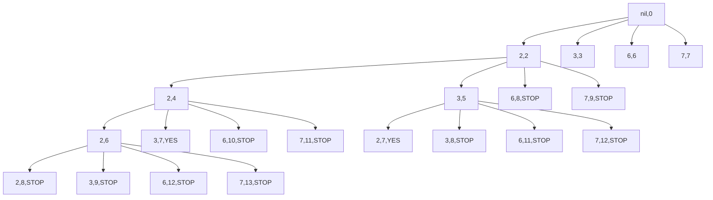

# Thought Process
It want all unique combinations, so it has to go through the combination of the values repeatedly, each time we add a number we append it to `result` array. If it `sum` reaches `7`, it will stop and append `result` to an array of `results`. If it exceeds 7, it will also stop but `result` wont be appended to `results`.

For example 1
```python
candidates = [2, 3, 6, 7]
target = 7
print(Solution().combinationSum(candidates, target))
```

Mermaid graph will be `(<candidate-number>, <current-sum-after-adding-current-candidate-number>)`.
- `<current-sum> = <previous-sum> + <current-candidate-number>`
- `<previous-sum>` inclues the `<previous-candidate-number>` already

This mermaid graph shows a partial condition of what happens, but the key is to add every value of the array for every iteration until it leads to `7` or greater.