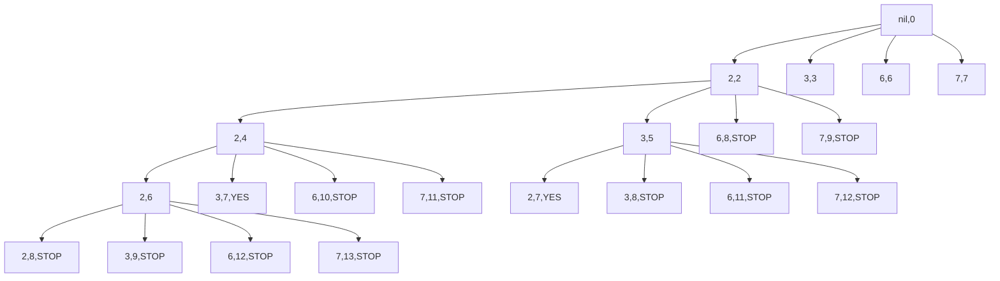
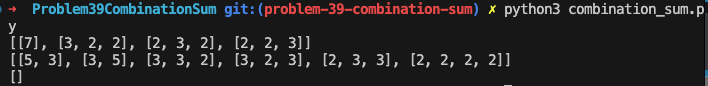

# Thought Process
It want all unique combinations, so it has to go through the combination of the values repeatedly, each time we add a number we append it to `result` array. If it `sum` reaches `7`, it will stop and append `result` to an array of `results`. If it exceeds 7, it will also stop but `result` wont be appended to `results`.

For example 1
```python
candidates = [2, 3, 6, 7]
target = 7
print(Solution().combinationSum(candidates, target))
```

Mermaid graph will be `(<candidate-number>, <current-sum-after-adding-current-candidate-number>)`.
- `<current-sum> = <previous-sum> + <current-candidate-number>`
- `<previous-sum>` inclues the `<previous-candidate-number>` already

This mermaid graph shows a partial condition of what happens, but the key is to add every value of the array for every iteration until it leads to `7` or greater.

# Problems
## Problem 1: Duplicate values ish `[3,3,2]`, `[2,3,3]`, etc.
As can be seen some values are duplicated, and we don't really want that, we want the unique combinations.


So instead of doing this
```python
class Solution:
    def combinationSum(self, candidates: List[int], target: int) -> List[List[int]]:
        # (candidate, sum-including-candidate, [...candidates-used])
        stack = [(0, 0, [])]
        results = []

        # count = 0

        # for candidate in candidates:
        #     stack.append((candidate, count + candidate, [candidate]))

        # print(stack)

        while stack:
            prev_candidate, prev_count, prev_candidates_used = stack.pop()

            for curr_candidate in candidates:
                curr_count = prev_count + curr_candidate

                if curr_count > target:
                    continue
                    # print(f"run stack pop, {curr_count} > 7")
                    # stack.pop()  # this is the value with curr_count > 7, don't need to continue counting again, and is done after appending
                elif curr_count == target:
                    # print(
                    #     f"run curr_count == 7, {[*prev_candidates_used, curr_candidate]}")
                    # stack.pop()  # also pop if its 7, coz no longer need to count, but can just append to results
                    results.append([*prev_candidates_used, curr_candidate])
                else:  # < 7
                    stack.append((curr_candidate, curr_count, [
                                 *prev_candidates_used, curr_candidate]))

            # print(stack)

        return results
```

we can adjust the `result` in `results` to hold ascending arrays, in which we can do by doing this
```python
class Solution:
    def combinationSum(self, candidates: List[int], target: int) -> List[List[int]]:
        # (candidate, sum-including-candidate, [...candidates-used])
        stack = [(0, 0, [])]
        results = []

        # count = 0

        # for candidate in candidates:
        #     stack.append((candidate, count + candidate, [candidate]))

        # print(stack)

        while stack:
            prev_candidate, prev_count, prev_candidates_used = stack.pop()

            for curr_candidate in candidates:
                curr_count = prev_count + curr_candidate

                if len(prev_candidates_used) >= 1 and prev_candidates_used[-1] > curr_candidate:
                    continue

                if curr_count > target:
                    continue
                    # print(f"run stack pop, {curr_count} > 7")
                    # stack.pop()  # this is the value with curr_count > 7, don't need to continue counting again, and is done after appending
                elif curr_count == target:
                    # print(
                    #     f"run curr_count == 7, {[*prev_candidates_used, curr_candidate]}")
                    # stack.pop()  # also pop if its 7, coz no longer need to count, but can just append to results
                    results.append([*prev_candidates_used, curr_candidate])
                else:  # < 7
                    stack.append((curr_candidate, curr_count, [
                                 *prev_candidates_used, curr_candidate]))

            # print(stack)

        return results
```
skip `for` loop, when `prev_value > curr_value`.

# Final Solution
So this is the final solution with all comments.
```python
class Solution:
    def combinationSum(self, candidates: List[int], target: int) -> List[List[int]]:
        # (candidate, sum-including-candidate, [...candidates-used])
        stack = [(0, 0, [])]
        results = []

        # count = 0

        # for candidate in candidates:
        #     stack.append((candidate, count + candidate, [candidate]))

        # print(stack)

        while stack:
            prev_candidate, prev_count, prev_candidates_used = stack.pop()

            for curr_candidate in candidates:
                curr_count = prev_count + curr_candidate

                if len(prev_candidates_used) >= 1 and prev_candidates_used[-1] > curr_candidate:
                    continue

                if curr_count > target:
                    continue
                    # print(f"run stack pop, {curr_count} > 7")
                    # stack.pop()  # this is the value with curr_count > 7, don't need to continue counting again, and is done after appending
                elif curr_count == target:
                    # print(
                    #     f"run curr_count == 7, {[*prev_candidates_used, curr_candidate]}")
                    # stack.pop()  # also pop if its 7, coz no longer need to count, but can just append to results
                    results.append([*prev_candidates_used, curr_candidate])
                else:  # < 7
                    stack.append((curr_candidate, curr_count, [
                                 *prev_candidates_used, curr_candidate]))

            # print(stack)

        return results
```
