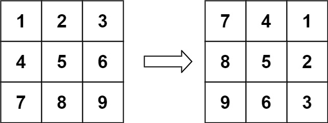

# Thought Process
How does rotating this matrix work? 

`matrix[0][0]` move-to `matrix[0][2]` 
`matrix[0][1]` move-to `matrix[1][2]`
`matrix[0][2]` move-to `matrix[2][2]`

`matrix[1][0]` move-to `matrix[0][1]` 
`matrix[1][1]` move-to `matrix[1][1]` 
`matrix[1][2]` move-to `matrix[2][1]`

`matrix[2][0]` move-to `matrix[0][0]` 
`matrix[2][1]` move-to `matrix[1][0]` 
`matrix[2][2]` move-to `matrix[2][0]`

`0 -> 2`, `1 -> 1` , `2 -> 0`, what to do with this.
`0 -> n-1`, `1 -> (n-1)-1`, ..., `i -> (n-1)-i`, ..., `n-1 -> (n-1)-(n-1)`.

`matrix[i][j]` move-to `matrix[j][(n-1)-i]`

Invert it becomes this

`matrix[(n-1)-j][i]` move-to `matrix[i][j]`

Once u rotate u need to rotate four blocks at once. 