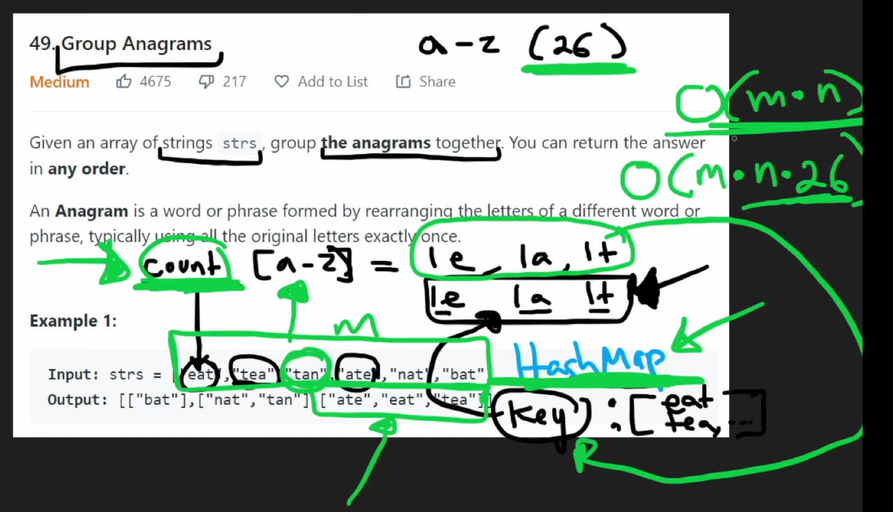

# Problems Faced
## Problem 1: `AttributeError: 'NoneType' object has no attribute 'append'`
```python

class Solution:

    def isAnagram(self, str1, str2):  # HELPER
        # str1 and str2 are anagrams if each letter in each string has the same number of appearances

        # modularize this IF GOT TIME
        hash1 = {}
        for letter in str1:
            if letter in hash1:
                hash1[letter] = hash1[letter] + 1
            else:
                hash1[letter] = 1

        hash2 = {}
        for letter in str1:
            if letter in hash2:
                hash2[letter] = hash2[letter] + 1
            else:
                hash2[letter] = 1

        return True if hash1 == hash2 else False

    def hasAnagramInHash(self, hash, string):
        for str_key in hash.keys():
            if self.isAnagram(string, str_key):
                return True, str_key
        return False, string

    def groupAnagrams(self, strs: List[str]) -> List[List[str]]:
        hash = {}

        for word in strs:
            has_anagram, str_key = self.hasAnagramInHash(hash, word)
            print(f"hash: {hash}")
            if has_anagram:
                "has anagram"
                hash[str_key] = hash[str_key].append(word)
            else:
                "! has anagram"
                hash[str_key] = [str_key]

        return list(hash.values())

...

# test case 1
strs = ["eat", "tea", "tan", "ate", "nat", "bat"]
solution = Solution()
assert solution.groupAnagrams(
    strs) == [["bat"], ["nat", "tan"], ["ate", "eat", "tea"]]

```

Why that error appears given log?
```bash
hash: {}
hash: {'eat': ['eat']}
hash: {'eat': None}
```

Why is the value `None` there?

Mistake is in this line
```python
...
hash[str_key] = hash[str_key].append(word)
...
```
This replaces the whole `hash[str_key]` into `hash[str_key].append(word)`, and just fyi, it the function `.append(...)` appends the list but returne `None`.


## Problem 2: `hasAnagramInHash` returns `True` for `'tan'` when key is `'eat'`
```python
class Solution:

    def isAnagram(self, str1, str2):  # HELPER
        # str1 and str2 are anagrams if each letter in each string has the same number of appearances

        # modularize this IF GOT TIME
        hash1 = {}
        for letter in str1:
            if letter in hash1:
                hash1[letter] = hash1[letter] + 1
            else:
                hash1[letter] = 1

        hash2 = {}
        for letter in str1:
            if letter in hash2:
                hash2[letter] = hash2[letter] + 1
            else:
                hash2[letter] = 1

        return True if hash1 == hash2 else False

    def hasAnagramInHash(self, hash, string):
        for str_key in hash.keys():
            if self.isAnagram(string, str_key):
                return True, str_key
        return False, string

    def groupAnagrams(self, strs: List[str]) -> List[List[str]]:
        hash = {}

        for word in strs:
            has_anagram, str_key = self.hasAnagramInHash(hash, word)
            print(f"hash: {hash}")
            if has_anagram:
                print("has anagram")
                hash[str_key].append(word)
            else:
                print("! has anagram")
                hash[str_key] = [str_key]

        return list(hash.values())

...

# test case 1
strs = ["eat", "tea", "tan", "ate", "nat", "bat"]
solution = Solution()
assert solution.groupAnagrams(
    strs) == [["bat"], ["nat", "tan"], ["ate", "eat", "tea"]]

```

Logging this returns `True`
```python
print(Solution().isAnagram("tan", "eat")) # True but should be False instead
```

Function `isAnagram` is wrong!
I am iterating over `str1` for `hash2`, should be `str2` in this line
```python
...        
    hash2 = {}
    for letter in str1:
...
```

## Problem 3: Time limit exceeded
```python
class Solution:

    def isAnagram(self, str1, str2):  # HELPER
        # str1 and str2 are anagrams if each letter in each string has the same number of appearances

        # modularize this IF GOT TIME
        hash1 = {}
        for letter in str1:
            if letter in hash1:
                hash1[letter] = hash1[letter] + 1
            else:
                hash1[letter] = 1

        hash2 = {}
        for letter in str2:
            if letter in hash2:
                hash2[letter] = hash2[letter] + 1
            else:
                hash2[letter] = 1

        return True if hash1 == hash2 else False

    def hasAnagramInHash(self, hash, string):  # HELPER
        for str_key in hash.keys():
            if self.isAnagram(string, str_key):
                return True, str_key
        return False, string

    def groupAnagrams(self, strs: List[str]) -> List[List[str]]:
        hash = {}

        for word in strs:
            has_anagram, str_key = self.hasAnagramInHash(hash, word)
            if has_anagram:
                hash[str_key].append(word)
            else:
                hash[str_key] = [str_key]

        return list(hash.values())
```

What can be optimized here?

ChatGPT suggested
```python
class Solution:

    def groupAnagrams(self, strs: List[str]) -> List[List[str]]:
        hash = {}

        for word in strs: # O(N)
            # Use sorted tuple of the word as key
            sorted_word = tuple(sorted(word))  # Sorting the word to create a unique key  for anagrams, at most O(L^2)
            if sorted_word in hash: # this step can be O(1) and not O(N) since we don't need to iterate over every word in the hash
                hash[sorted_word].append(word)
            else:
                hash[sorted_word] = [word]

        return list(hash.values())
```

`isAnagram(...)` - `O(L)` complexity, `L` is the length of the string, instead of counting the no of appearances of each letter can just do the suggested, sort the word - equivalent to `sorted(word)` also `O(L)`
`hasAnagramInHash(...)` - `O(N * L)` complexity, `N` is the length of `strs` input array - THIS CAN BE OPTIMIZED, because searching for an item in hash should not need iteration - In the new code this is equivalent to checking `sorted_word in hash` which is O(1) complexity
`groupAnagrams(...)` - `O(N^2 * L)` complexity - same complexity of `O(N)` when iterating for every `word` inside `strs`

To optimize finding the same anagram in the hash, we can do `sorted_word = tuple(sorted(word))` and `sorted_word in hash` to make the operation quicker.

Most important factor here, it uses the `sorted_word` as the key since it is the common thing between all the anagrams, then the values be the `word` in its initial form, before sorted. Hence, even with a few different `word`s that are anagrams, it can still be mapped to the same `sorted_word` value.

# Neetcode Solution
Instead of `O(N * L * log L)` how to make it shorter.

This is his drawing of the solution


So basically his solution is to...
1. initialize `count` variable, empty array with `[0, ...<26-times-total>... ,0]` to count the number of how many times the letter appears. For the index, map `'a'` to `0`, ..., map `'z'` to `25`, then the value will be the 
2. For each letter in the `word`, do `+1` to the `count` element corresponding letter represented as index. Example, `'abb'` means `count = [1,2,0,...,0]`
3. Use this count as the key in `hash`, append `word` to `hash[count]` if `count` in  `hash`, initialize `count` in `hash` with `[word]` if not.

```python
class Solution:
    def groupAnagrams(self, strs: List[str]) -> List[List[str]]:
        hash = {}  # key is sorted word string, value is array of anagrams

        for word in strs:
            count = [0 for i in range(26)]

            for letter in word:
                ascii_letter = ord(letter)
                ascii_a = ord('a')
                idx = ascii_letter - ascii_a

                count[idx] = count[idx] + 1

            if tuple(count) in hash:
                hash[tuple(count)].append(word)
            else:
                hash[tuple(count)] = [word]

        return list(hash.values())
```

Here is the code with a little less memory usage.
```python
class Solution:
    def groupAnagrams(self, strs: List[str]) -> List[List[str]]:
        hash = {}  # key is sorted word string, value is array of anagrams

        for word in strs:
            count = [0] * 26

            for letter in word:
                count[ord(letter) - ord('a')] += 1

            if tuple(count) in hash:
                hash[tuple(count)].append(word)
            else:
                hash[tuple(count)] = [word]

        return list(hash.values())
```

Here is a python feature that makes the `hash` default to create an empty list everytime `hash[count]` does not exist, so no need to check for the if statement. Uses `defaultdict(list)`.

```python
class Solution:
    def groupAnagrams(self, strs: List[str]) -> List[List[str]]:
        # key is sorted word string, value is array of anagrams
        hash = defaultdict(list)

        for word in strs:
            count = [0] * 26

            for letter in word:
                count[ord(letter) - ord('a')] += 1

            hash[tuple(count)].append(word)

        return list(hash.values())
```