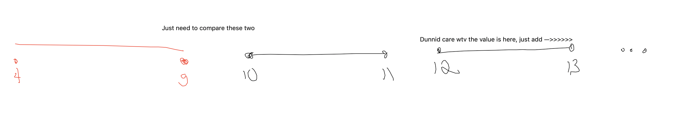
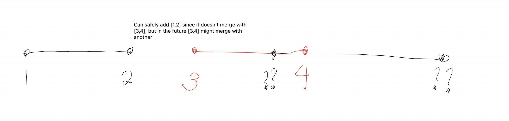
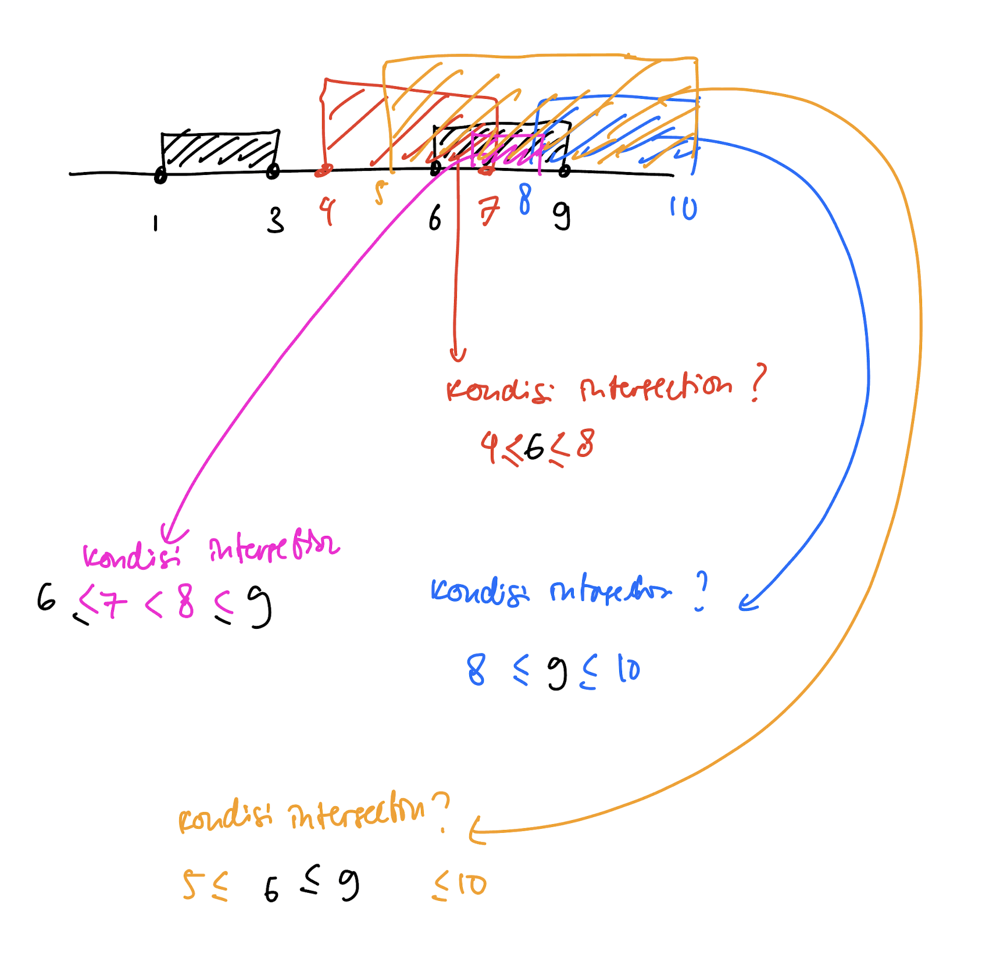

# Thought Process
```
[[1, 2], [3, 5], [6, 7], [8, 10], [12, 16]]

[4, 8]

res = []

newInterval = [4, 8]
[1, 2] --> no merge --> append [1, 2] --> res = [ [1,2] ]
newInterval is still [4, 8]


[3, 5] --> merge --> newInterval = [4, 8] --> append [4, 8] --> res = [ [1,2], [4,8] ]

[6, 7] --> merge --> newInterval = [4, 8] --> pop res[-1] --> res = [ [1,2] ] --> append newInterval = [4, 8] --> res = [ [1,2], [4,8] ]
```

Append pop not efficient.

# Neetcode solution
Main thing here is 3 generic cases.

**Case 1**: `newInterval` is at the left of an `interval` at `i`
This means, the `newInterval` does not need to be extended, and we just need to add this `newInterval` to `result`, and straight up return `result` with rest of the `intervals` from `i` to the last interval. The checking for merging is done here, as there won't be more merges in the future.



**Case 2**: `newInterval` is at the right of an `interval` at `i`
This means, this `interval` at `i` has no overlap with `newInterval`, but newInterval still might merge with some other `interval` in the future.



**Case 3**: `newInterval` overlaps with `interval` at `i`
Me personally, started with dividing this into four ways of merging, split into color. But turns this, can be put into an else case, no need to specify how it is merging. Just needed to take the min for `new_l` and `anchor_l`, as well as max for `new_r` and `anchor_r`. In this case, we shouldn't be appending the `newInterval` yet, as it might keep updating until the end, for example `newInterval` `[1,10]` would just continue updating until the end if `intervals` is `[[1,2],[3,4],[5,6]]`. So in this case, we just keep updating `newInterval`, either until it reaches the end (and we call `result.append(newInterval)` after the loop). Or it reaches **Case 1**.



So here's my code, without removing the print cases to debug.
```python
class Solution:
    def insert(self, intervals: List[List[int]], newInterval: List[int]) -> List[List[int]]:
        result = []

        for i, interval in enumerate(intervals):
            # check if this interval merges with newInterval
            anchor_l, anchor_r = interval

            new_l, new_r = newInterval

            if new_r < anchor_l:  # newInterval is at the left of some interval at i
                print(
                    f"newInterval {newInterval} at the left of some interval {i} {interval}")
                result.append(newInterval)
                return result + intervals[i:]

            elif new_l > anchor_r:
                print(
                    f"newInterval {newInterval} is at the right of interval {i} {interval}, safely append the interval")

                result.append(interval)

            elif new_l <= anchor_l <= anchor_r <= new_r:
                print(
                    f"Yellow merge interval {interval} with newInterval {newInterval}")
                newInterval = [new_l, new_r]

            elif anchor_l <= new_l <= new_r <= anchor_r:
                print(
                    f"Pink merge interval {interval} with newInterval {newInterval}")
                newInterval = [anchor_l, anchor_r]

            elif new_l <= anchor_l <= new_r:
                print(
                    f"Red merge interval {interval} with newInterval {newInterval}")
                newInterval = [new_l, anchor_r]

            elif new_l <= anchor_r <= new_r:
                print(
                    f"Blue merge interval {interval} with newInterval {newInterval}")
                newInterval = [anchor_l, new_r]

            # elif new_r < anchor_l:  # newInterval is at the left of some interval at i
            #     print(
            #         f"newInterval {newInterval} at the left of some interval {i} {interval}")
            #     result.append(newInterval)

            # elif new_l > anchor_r:
            #     print(
            #         f"newInterval {newInterval} is beyond interval {i} {interval}, safely append the interval")

            #     result.append(interval)

            print(f'the newInterval is {newInterval}, result is {result}')

        result.append(newInterval)

        return result

```

