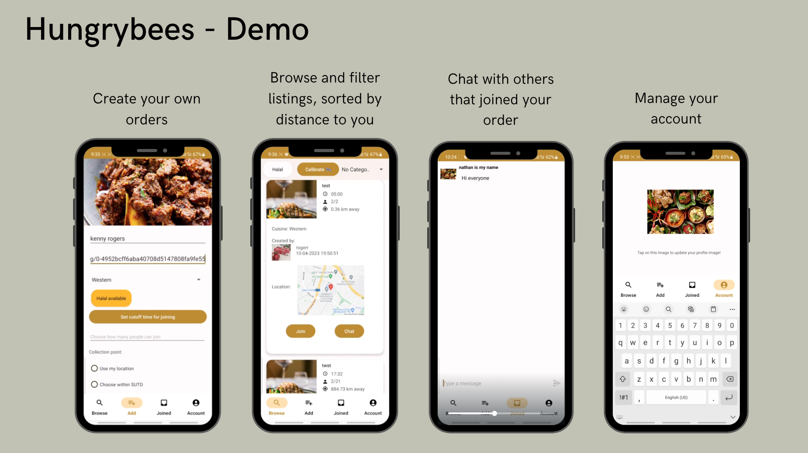

# Interview Process

## Question 1
First, he asked me to introduce myself, then I introduce myself with slides. When I was showing off hungrybees, he asked me about `RecyclerView`, how did I do it. Like if I was rendering a very long list (10k entries), how do I make the performance optimized, since its gonna take very long, to render everything. REVIEW MORE ON THIS.

The second mobile phone there.


## Question 2
Given a string `"abcd-e-f"` reverse the string but keep the dashes (or non-letters) there. So the reverse string here will be `"fedc-b-a"`.

Solution uses two pointer, then always do check for values at both pointers
- `s[l]` and `s[r]` are letters (`<some-character>.isalpha()`) &rarr; `switch s[l] and s[r]`; `move l+=1`, `move r-=1`
- `s[l]` letter, `s[r]` not letter &rarr; `move r-=1`
- `s[l]` not letter, `s[r]` letter &rarr; `move l+=1`
- `s[l]` and `s[r]` not letters &rarr; `move r-=1`, `move l+=1`

This is the code I wrote with some test cases in mind, in `src/TikTokInterview20241009/main.py`.
```python
def reverse_string(s):
    s = list(s)
    l, r = 0, len(s)-1

    while l <= r:  # pointer is not colliding

        # first case 1: s[l] and s[r] are characters
        if s[l].isalpha() and s[r].isalpha():
            # switch s[l] and s[r]
            temp = s[l]
            s[l] = s[r]
            s[r] = temp

            l += 1
            r -= 1
            continue
        elif not s[r].isalpha() and s[l].isalpha():
            # let it be
            r -= 1
        elif not s[l].isalpha() and s[r].isalpha():
            # let it be
            l += 1
        else:
            # let it be
            r -= 1
            l += 1

    return ''.join(s)


s1 = "abcd-e-f"
print(reverse_string(s1))  # fedc-b-a

s2 = "e-abc-d"
print(reverse_string(s2))  # d-cba-e
```


He finally asked, if there was any other test case I can consider. For this, maybe should consider some more edge cases.

Asked chatgpt if code is correct? and for some additional test cases?

# Personal Feedback
